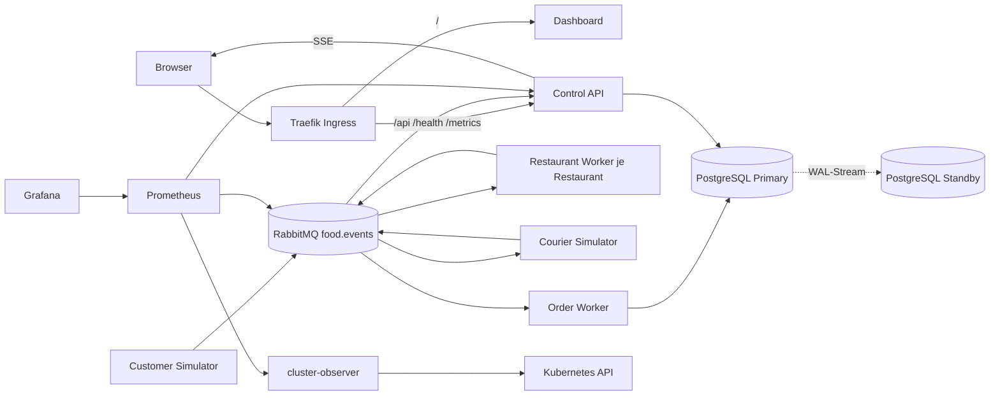
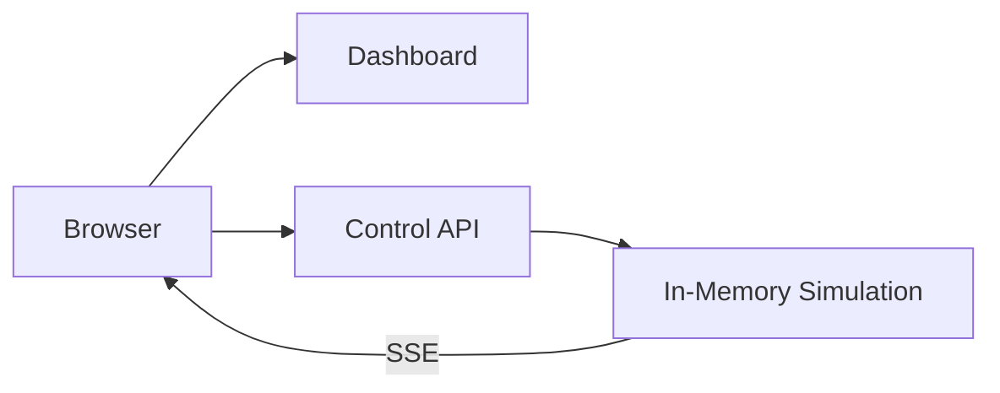
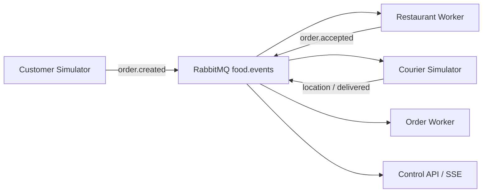

# Architektur

## Zielbild

Endstand nach Ausbaustufe 7. Der Browser erreicht alles über einen Einstiegspunkt, die fachliche Verarbeitung läuft über Events, der Zustand liegt in PostgreSQL.



| Komponente | Aufgabe | Betrieb |
|---|---|---|
| `dashboard` | 2.5D-Stadt, Systemansicht, Steuerung | Deployment, 2 Replicas |
| `control-api` | REST, SSE, Health, Metrics | Deployment, ab Ausbaustufe 6 zwei Replicas |
| `customer-simulator` | erzeugt Kunden und Bestellungen | StatefulSet |
| `restaurant-worker` | nimmt Bestellungen an oder lehnt ab | je ein Deployment pro Restaurant |
| `courier-simulator` | Fahrten und Zustellungen | StatefulSet |
| `order-worker` | Projektion und Idempotenz | Deployment, 2 Replicas |
| `rabbitmq` | Topic Exchange, Queues, DLQ | StatefulSet mit PVC |
| `food-delivery-db` | PostgreSQL Primary und Standby | CloudNativePG Cluster-Resource |
| `cluster-observer` | liest Workload-Zustände aus der Kubernetes-API | Deployment mit eigener Role |
| Monitoring | Prometheus, Grafana, ServiceMonitors | Helm-Release im Namespace `monitoring` |

## Eventfluss

Alle Events gehen an den Topic Exchange `food.events`. Der Routing Key ist der Event-Typ; bei `order.created` wird die Restaurant-ID angehängt, damit jede Küche nur ihre eigenen Bestellungen erhält.

| Queue | Consumer | Bindings | Zweck |
|---|---|---|---|
| `restaurant.<restaurant-id>` | `restaurant-worker` | `order.created.<restaurant-id>` | Bestellungen einer Küche |
| `courier-dispatch` | `courier-simulator` | `order.accepted` | Fahrt starten |
| `order-projection` | `order-worker`, 2 Replicas | `order.#`, `courier.#`, `customer.#`, `simulation.#` | Projektion in PostgreSQL |
| `live.<pod>` | `control-api`, je Pod eine eigene Queue | `#` | Live-Updates für den SSE-Stream |
| `simulation-control.<pod>` | `customer-simulator` | `simulation.#` | Start, Pause, Reset |
| `food.dead` | — | `#` über den Dead Letter Exchange `food.dlx` | dauerhaft fehlerhafte Nachrichten |

Weg einer Bestellung:

```
customer.registered → order.created.<restaurant> → order.accepted | order.rejected
   → courier.assigned → courier.location.updated → order.picked_up → order.delivered
```

Dazu kommen die Steuerungsevents `simulation.started`, `simulation.paused` und `simulation.reset`.

Jedes Event trägt `event_id`, `event_type`, `event_version`, `occurred_at`, `correlation_id`, `source` und einen typisierten Payload. Die `event_id` ist die Grundlage der Deduplizierung, die `correlation_id` verbindet alle Events einer Bestellung.

## Datenhaltung

Der Order Worker ist der einzige Schreiber des fachlichen Zustands. Alle anderen Dienste lesen oder reagieren auf Events.

| Tabelle | Inhalt |
|---|---|
| `restaurants`, `customers`, `couriers` | Stammdaten der Simulation |
| `orders` | aktueller Zustand einer Bestellung |
| `order_events` | fachlicher Verlauf je Bestellung, Schlüssel `event_id` |
| `processed_events` | bereits verarbeitete `event_id`, Grundlage der Idempotenz |

Zugriff läuft ausschliesslich über die vom Operator verwalteten Services: `food-delivery-db-rw` für Schreibzugriffe auf den Primary, `-ro` für Lesezugriffe auf die Standbys und `-r` für alle Instanzen. Die Anwendung kennt keinen Pod-Namen.

## Wichtigste Entscheidungen

| Entscheidung | Grund | Preis |
|---|---|---|
| Control API bis Ausbaustufe 5 mit einer Replica, ab Ausbaustufe 6 mit zwei | Solange der Zustand im Speicher liegt, hätte jede Replica ihre eigene Wahrheit. Mit PostgreSQL teilen sich alle dieselbe Quelle. | Der Schritt zur Skalierbarkeit kostet eine Datenbank samt Betrieb |
| Ein Kustomize-Overlay je Ausbaustufe, verkettet auf die vorherige | Jeder Kursblock bleibt einzeln deploybar, die Unterschiede sind sichtbar, keine kopierten YAML-Dateien | Man muss die Kette kennen, um zu wissen, was ein Overlay erbt |
| At-least-once mit Idempotenz über die `event_id` | Keine Nachricht geht verloren; der Dedupe-Eintrag und die fachliche Wirkung liegen in derselben Transaktion | Duplikate sind möglich und müssen im Consumer abgefangen werden |
| Dauerhafte Fehler ohne Requeue in die DLQ | Eine kaputte Nachricht blockiert die normale Queue nicht | Ohne Wiederholungsversuch landen auch kurzzeitige Fehler in `food.dead` |
| Asynchrone Replikation in PostgreSQL | Schnelle Schreibzugriffe, Failover ohne Wartezeit auf den Standby | Ein Ausfall vor dem Replay kann die letzten bestätigten Transaktionen kosten |

## Ausbaustufen

Die folgenden Abschnitte zeigen, wie der Stand Block für Block gewachsen ist.

### Block 3: Standalone

Das Dashboard und die Control API laufen als getrennte Deployments. Die Control API besitzt vorerst den In-Memory-Zustand und führt die Simulation aus.



Die bewusste Einschränkung ist sichtbar: `control-api` darf noch nicht horizontal skaliert werden. Mehrere Replicas hätten voneinander abweichende Zustände. Messaging und Persistenz lösen dies in späteren Blöcken.

### Block 4: Ingress und Load Balancing

Traefik veröffentlicht Dashboard und API unter einem gemeinsamen Einstiegspunkt:

- `/` wird zum `dashboard`-Service geroutet.
- `/api`, `/health` und `/metrics` werden zum `control-api`-Service geroutet.
- Zwei Dashboard-Pods zeigen das Load Balancing des Services.
- Die Control API bleibt wegen des In-Memory-Zustands bei einer Replica.

### Block 5: Messaging

RabbitMQ entkoppelt die fachliche Verarbeitung:



Die Verarbeitung ist at-least-once. Der Order Worker besitzt in diesem Block nur einen lokalen Idempotenzspeicher. Ein Pod-Neustart zeigt deshalb bewusst die noch offene Persistenzlücke.

### Block 6: CloudNativePG und Persistenz

Der Order Worker ist der einzige Schreiber des fachlichen Zustands. Er verarbeitet jedes Event mit einer PostgreSQL-Transaktion:

1. `event_id` in `processed_events` beanspruchen.
2. Fachliche Zustandsänderung projizieren.
3. Relevantes Event in `order_events` ablegen.
4. Transaktion committen und erst danach die RabbitMQ-Nachricht bestätigen.

Die Anwendungen verwenden den von CloudNativePG verwalteten `food-delivery-db-rw`-Service. Dieser zeigt nach einem Failover automatisch auf den neuen Primary.

### Block 7: Observability, Resilienz und Skalierung

Prometheus sammelt die Messwerte über `ServiceMonitor` und `PodMonitor`; der `cluster-observer` stellt Soll- und Ist-Zustand der Workloads als `food_delivery_cluster_desired_pods` und `_ready_pods` bereit. Das Grafana-Dashboard «Dispatch City - Betrieb» zeigt offene und gelieferte Bestellungen, bereite Worker und die wartenden Nachrichten je Restaurant.

Die Warteschlange ist die aussagekräftigste Kennzahl: Fällt ein Consumer aus, meldet der Cluster weiterhin «bereit gleich gewünscht», weil `replicas=0` den Soll-Zustand mit absenkt. Sichtbar wird der Ausfall allein am wachsenden Rückstau.

Readiness und Liveness trennen zwei Fragen. Eine fehlgeschlagene Readiness-Probe nimmt den Pod aus der `EndpointSlice`, ohne den Container neu zu starten; erst eine fehlgeschlagene Liveness-Probe löst einen Neustart aus.

Rolling Updates und Rollback haben wir im Übungs-Namespace `betrieb-lab` durchgespielt: Mit `maxUnavailable: 0` und `maxSurge: 1` blockiert ein unbrauchbares Image das Update, statt die Verfügbarkeit zu senken. In Dispatch City gilt die Kubernetes-Vorgabe von 25 % / 25 %. `rollout undo` setzt in beiden Fällen die Pod-Vorlage zurück, nicht den Datenbestand.

Jeder Container deklariert CPU-Requests und -Limits. Der Request ist die Grundlage der Platzierung und die Bezugsgrösse des HPA-Ziels, das Limit die Obergrenze zur Laufzeit — bei CPU wird gedrosselt, bei Memory beendet.
