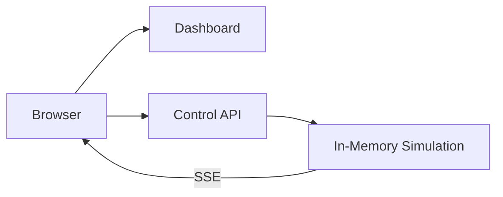
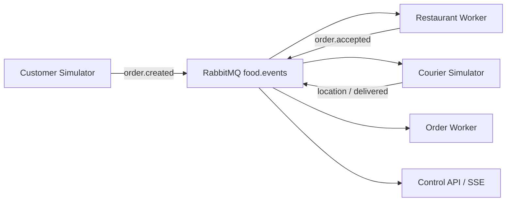

# Architektur

## Block 3: Standalone

Das Dashboard und die Control API laufen als getrennte Deployments. Die Control API besitzt vorerst den In-Memory-Zustand und führt die Simulation aus.

Die bewusste Einschränkung ist sichtbar: `control-api` darf noch nicht horizontal skaliert werden. Mehrere Replicas hätten voneinander abweichende Zustände. Messaging und Persistenz lösen dies in späteren Blöcken.

## Block 4: Ingress und Load Balancing

Traefik veröffentlicht Dashboard und API unter einem gemeinsamen Einstiegspunkt:

- `/` wird zum `dashboard`-Service geroutet.
- `/api`, `/health` und `/metrics` werden zum `control-api`-Service geroutet.
- Zwei Dashboard-Pods zeigen das Load Balancing des Services.
- Die Control API bleibt wegen des In-Memory-Zustands bei einer Replica.

## Block 5: Messaging

RabbitMQ entkoppelt die fachliche Verarbeitung:

Die Verarbeitung ist at-least-once. Der Order Worker besitzt in diesem Block nur einen lokalen Idempotenzspeicher. Ein Pod-Neustart zeigt deshalb bewusst die noch offene Persistenzlücke.

## Block 6: CloudNativePG und Persistenz

Der Order Worker ist der einzige Schreiber des fachlichen Zustands. Er verarbeitet jedes Event mit einer PostgreSQL-Transaktion:

1. `event_id` in `processed_events` beanspruchen.
2. Fachliche Zustandsänderung projizieren.
3. Relevantes Event in `order_events` ablegen.
4. Transaktion committen und erst danach die RabbitMQ-Nachricht bestätigen.

Die Anwendungen verwenden den von CloudNativePG verwalteten `food-delivery-db-rw`-Service. Dieser zeigt nach einem Failover automatisch auf den neuen Primary.

## Block 7: Observability, Resilienz und Skalierung

Prometheus sammelt die Messwerte über `ServiceMonitor` und `PodMonitor`; der `cluster-observer` stellt Soll- und Ist-Zustand der Workloads als `food_delivery_cluster_desired_pods` und `_ready_pods` bereit. Das Grafana-Dashboard «Dispatch City - Betrieb» zeigt offene und gelieferte Bestellungen, bereite Worker und die wartenden Nachrichten je Restaurant.

Die Warteschlange ist die aussagekräftigste Kennzahl: Fällt ein Consumer aus, meldet der Cluster weiterhin «bereit gleich gewünscht», weil `replicas=0` den Soll-Zustand mit absenkt. Sichtbar wird der Ausfall allein am wachsenden Rückstau.

Readiness und Liveness trennen zwei Fragen. Eine fehlgeschlagene Readiness-Probe nimmt den Pod aus der `EndpointSlice`, ohne den Container neu zu starten; erst eine fehlgeschlagene Liveness-Probe löst einen Neustart aus.

Rolling Updates laufen mit `maxUnavailable: 0` und `maxSurge: 1`. Ein unbrauchbares Image blockiert deshalb das Update, statt die Verfügbarkeit zu senken; `rollout undo` setzt die Pod-Vorlage zurück, nicht den Datenbestand.

Jeder Container deklariert CPU-Requests und -Limits. Der Request ist die Grundlage der Platzierung und die Bezugsgrösse des HPA-Ziels, das Limit die Obergrenze zur Laufzeit — bei CPU wird gedrosselt, bei Memory beendet.
