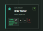
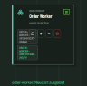
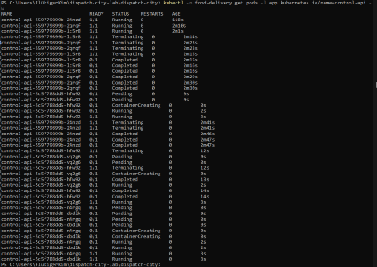

# Demo-Nachweis

Alle Bilder sind Bildschirmaufnahmen des laufenden Systems vom 21.09.2026. Die Oberflächen und die Szenarien 1 und 3 bis 6 stammen vom Cluster `teko-k8s` auf Kilians Rechner (17:30 bis 18:55). Szenario 2 hat Kim am Nachmittag auf dem eigenen Cluster unter Windows aufgenommen, mit derselben Anwendung aus unserem gemeinsamen Repository.

## Die vier Oberflächen

### Dashboard

Die Stadtansicht zeigt den fachlichen Ablauf: Bestellungen, Kuriere unterwegs, gelieferte Aufträge und den Event-Stream rechts.


Die Systemansicht zeigt dieselbe Anwendung technisch. Bei Control API und Order Worker stehen die laufenden Pods mit Namen (grün = bereit) und die Steuerknöpfe unserer Erweiterung.


### RabbitMQ

Eine Queue je Zweck: je Restaurant, für die Kurierzuteilung, für die Projektion in die Datenbank und je Control-API-Pod eine eigene Live-Queue. In `food.dead` liegen Nachrichten aus den DLQ-Übungen und aus den drei Failover-Tests weiter unten.


### Grafana

Das Dashboard «Dispatch City - Betrieb» mit offenen und gelieferten Bestellungen, bereiten Pizza-Workern, wartenden Nachrichten je Restaurant und dem Durchsatz.


### PostgreSQL / CloudNativePG

Die Datenbank läuft als CloudNativePG-Cluster mit einem Primary und einer Replica. Der Zustand ist im Failover-Szenario weiter unten dokumentiert.

## Die Steuerknöpfe im Dashboard

Die vier Knöpfe auf den Karten rufen Admin-Endpoints der Control API auf. Die Control API schreibt dann direkt gegen die Kubernetes-API, das Dashboard simuliert also nichts.

| Knopf | Wirkung im Cluster |
|---|---|
| Neustart (Pfeil) | setzt im Pod-Template die Annotation `restartedAt`, wie `kubectl rollout restart` |
| Plus / Minus | setzt `spec.replicas` des Deployments um eins höher oder tiefer |
| Totenkopf | löscht nach einer Rückfrage einen zufällig gewählten Pod des Deployments |

Damit die Control API das darf, läuft sie unter einem eigenen ServiceAccount. Dessen Role erlaubt neben Leserechten nur, Deployments zu patchen und Pods aufzulisten und zu löschen (`deploy/overlays/bonus-pod-admin/rbac-control-api-admin.yaml`). Zusätzlich lässt der Code nur fünf Deployments zu: Control API, Order Worker und die drei Restaurants (`internal/api/server.go`). Die Aufrufe gegen Kubernetes stehen in `internal/cluster/controller.go`.

## Szenario 1: Pod fällt aus, Kubernetes ersetzt ihn

Der Totenkopf-Knopf löscht einen Pod des gewählten Deployments. Vorher fragt das Dashboard nach.


Nach dem Klick beim Order Worker zeigt die Karte `1/2`, der neue Pod ist noch grau, und unten steht, welcher Pod gelöscht wurde.


Im Terminal ist der Ersatz nach drei Sekunden schon da, zunächst mit `0/1`, also noch nicht bereit.


Laut Pod-Status ist der neue Pod sieben Sekunden nach dem Start bereit. Eine Minute später steht das Deployment wieder bei `2/2`.


## Szenario 2: Neustart und Skalieren

Beim Order Worker haben wir Minus und Neustart ausprobiert. Dass Minus wirklich den Cluster verändert, zeigt `kubectl -n food-delivery get deployment order-worker` unabhängig vom Dashboard. Vorher:

```
NAME           READY   UP-TO-DATE   AVAILABLE   AGE
order-worker   3/3     3            3           27d
```

Nach dem Runterskalieren über Minus:

```
NAME           READY   UP-TO-DATE   AVAILABLE   AGE
order-worker   1/1     1            1           27d
```

Mit diesem einen Pod sieht der Neustart so aus: Links die Karte vor dem Klick, rechts direkt danach. Ein neuer Pod startet (noch grau), der alte läuft weiter, und unten steht «Neustart ausgelöst».

<div class="bildpaar">


</div>

Bei der Control API lief während vier Aktionen `kubectl get pods -l app.kubernetes.io/name=control-api -w` mit. Im Protokoll folgen sie so aufeinander: Minus, Neustart, Totenkopf, Plus.



### So erkennt man die Aktionen im Protokoll

- **Minus:** Einzelne Pods gehen auf `Terminating` und dann `Completed`, und es kommt kein neuer nach. Oben im Bild verschwinden so zwei der drei Pods.
- **Neustart:** Ein Pod mit einem neuen Hash im Namen erscheint und durchläuft `Pending`, `ContainerCreating` und `Running`. Erst wenn er bereit ist, geht der alte auf `Terminating`. Der Neustart läuft rollend, es ist nie alles gleichzeitig weg.
- **Totenkopf:** Genau ein Pod geht auf `Terminating`, und sofort erscheint ein Ersatz mit demselben Hash. Beim Neustart bekommt der Ersatz einen neuen Hash, weil sich das Pod-Template geändert hat. Beim Totenkopf bleibt das Template gleich, das ReplicaSet ersetzt nur den fehlenden Pod.
- **Plus:** Neue Pods mit demselben Hash erscheinen, ohne dass alte verschwinden. Am Ende laufen wieder drei.

Die Pod-Namen und Zahlen im Dashboard stimmten dabei jeweils mit `kubectl` überein.

## Szenario 3: Soll und Ist

Ein Klick auf Plus bei der Control API stellt sie auf drei Pods, nach wenigen Sekunden laufen alle drei (`3/3`). Das ändert nur den Cluster, nicht das Manifest. `kubectl diff` zeigt die Abweichung genau an.


`kubectl apply` setzt den Soll-Zustand aus dem Repository wieder durch, die Control API läuft wieder mit zwei Pods.


## Szenario 4: Eine Küche fällt aus, die Bestellungen stauen sich

Die Pizza-Küche wird auf null skaliert, danach gehen über den Knopf «Bestellung» 30 Bestellungen ein. Sie verteilen sich reihum auf die drei Restaurants. Bei Pizza bleiben sie liegen, Bowl und Curry arbeiten ihren Teil sofort ab.


In Grafana steht «Pizza-Worker bereit» auf 0, die Pizza-Kurve steigt. Der Ausfall zeigt sich also nicht als Fehlermeldung, sondern als wachsende Warteschlange.


## Szenario 5: Hochskalieren löst den Stau auf

Die Pizza-Küche läuft jetzt dreifach.


RabbitMQ zeigt drei Consumer an derselben Queue. Sie teilen sich die Arbeit, jede Nachricht geht an genau einen von ihnen. Im Diagramm oben sieht man die Warteschlange erst stehen und dann auf null fallen.


Grafana zeigt den ganzen Verlauf: Anstieg, Abbau auf null, drei Worker bereit. Danach wurde die Küche wieder auf einen Worker zurückgesetzt.


## Szenario 6: Datenbank-Failover

Vorher ist `food-delivery-db-2` der Primary, `food-delivery-db-rw` zeigt auf dessen IP, und in der Datenbank liegen 5762 Bestellungen, alle seit der Einrichtung am 31.08.


Um 18:04:33 wird der Primary gelöscht. Der Cluster steht danach gut drei Minuten auf «Failing over», dann übernimmt `food-delivery-db-1`, und um 18:07:53 ist der Cluster wieder gesund.


Nachher ist `food-delivery-db-1` Primary, `food-delivery-db-rw` zeigt auf die neue IP, und der alte Primary ist als Replica wieder dabei. Die Anwendung musste nichts umstellen, weil sie nur den Service-Namen kennt. Die Zahl der Bestellungen ist weiter gestiegen, auf 5777.


## Was wir dabei beobachtet haben

**Der Failover dauert gut drei Minuten, nicht Sekunden.** Wir haben ihn an diesem Tag dreimal ausgelöst, jedes Mal mit demselben Ergebnis. Beim Löschen des Pods fährt PostgreSQL zuerst kontrolliert herunter und wartet, bis alle Clients sich abmelden. Die Connection-Pools von Control API und Order Worker tun das nicht von selbst, also wartet PostgreSQL das volle Zeitlimit `smartShutdownTimeout` von 180 Sekunden ab. Solange läuft die Replikation weiter, und der Operator darf die Replica nicht befördern, um nicht zwei Primaries gleichzeitig zu haben. Das Operator-Log sagt genau das: «Waiting for all WAL receivers to be down to elect a new primary». Bei einem echten Absturz des Knotens entfällt dieses Warten.

**Bei jedem Failover landen Events in der Dead Letter Queue.** Während der drei Minuten kann der Order Worker nicht schreiben, und fehlgeschlagene Nachrichten gehen bei uns ohne Wiederholung direkt in die DLQ. Bei den drei Durchläufen stieg `food.dead` um 7, 11 und 4 Nachrichten. Das ist die Schwäche, die wir in der Architekturdokumentation schon benannt haben, hier ist sie belegt.

**Der Engpass verschiebt sich.** Die Küchen arbeiten die Bestellungen schnell ab, danach warten sie beim einzigen Kurier. `courier-dispatch` hatte während der Aufnahmen rund 60 wartende Nachrichten, abgebaut wird eine pro Minute. Hochskalieren an einer Stelle beschleunigt nur bis zum nächsten Engpass.
